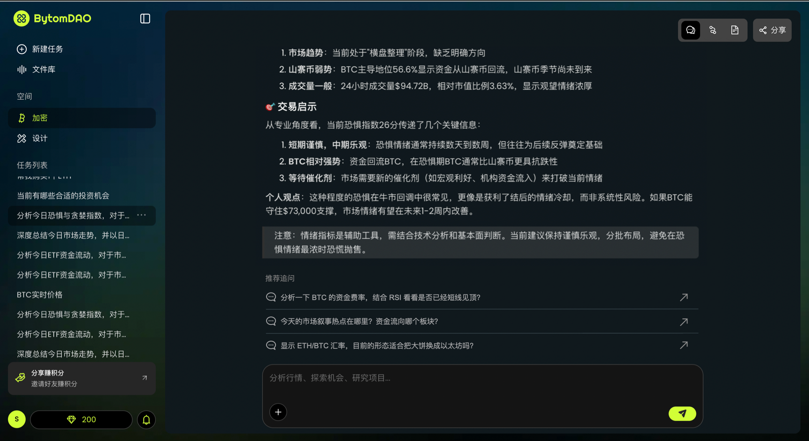
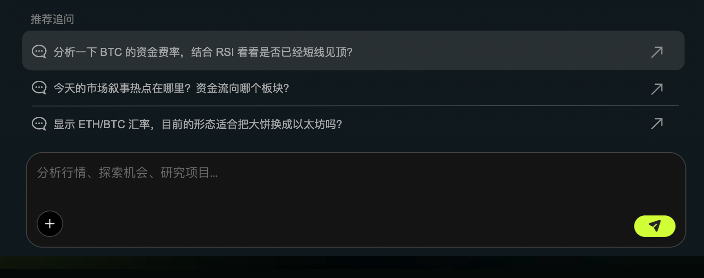
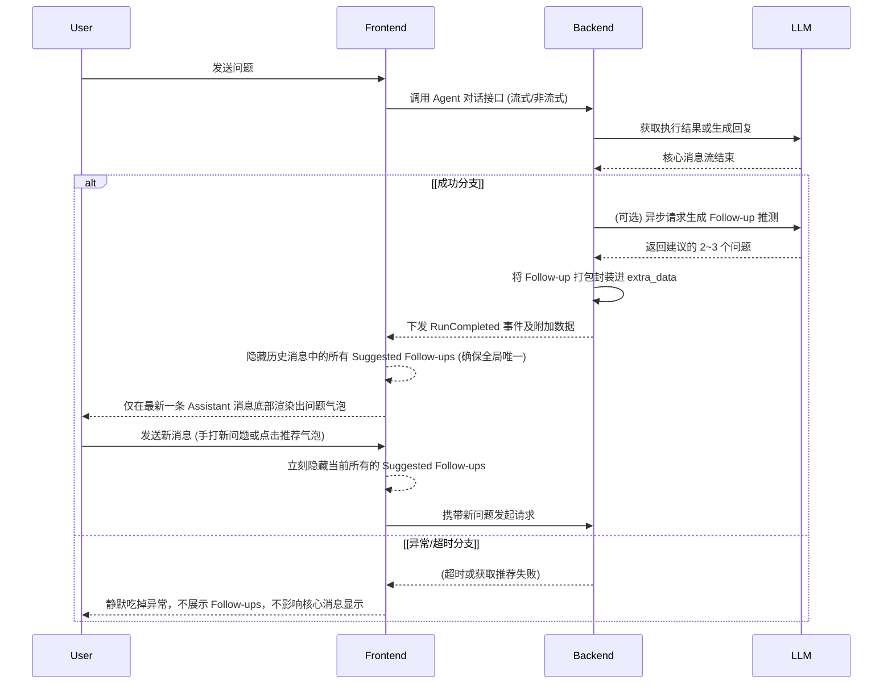
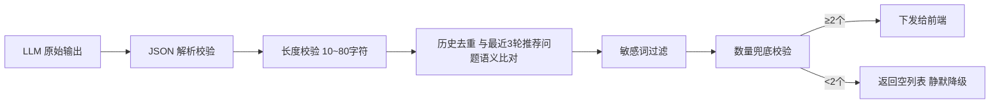

# PRD: 对话结束自动建议问题 (Suggested follow-ups)

**Date**: 2026-03-19 | **Status**: 🟢 Ready for Dev Agents

---

## 0. 核心上下文锚点 (Context Anchors)

> 供研发 Agent 读取本地代码使用

- **关联数据模型**: `@src/types/agno.ts` (需修改，在 `AgentExtraData` 中增加属性)
- **关联前端页面**: `@src/pages/Home/components/AssistantMessage.tsx` 和 `@src/pages/Home/components/TaskContent.tsx`
- **核心依赖接口**: 后端 `agent-api/api/main.py` 及底层 `Agno` 库处理 Agent 返回结果时的切面或回调 (注入到 API Response 的 `extra_data` 中)。

---

## 1. 业务目标与全局状态机 (Business & Architecture)

### 1.1 核心价值

在用户与 Agent 对话每次结束后，动态推断并推荐 3 个用户“可能想问”的后续问题（Suggested follow-ups），以此降低用户的认知门槛与输入成本，提升整体对话轮次、活跃度与用户体验。

全局原型


hover 效果


### 1.2 全局业务流转图 (Sequence & State)



---

## 2. [Role: Backend] 后端实现协议 (Backend Contract)

> 给后端 Agent 的执行指令：请严格按照以下 Schema 和逻辑生成代码。

### 2.1 数据模型变更 (DDL Schema)

无数据库建库/建表级别变更。仅在运行时的响应结构中追加字段。对于持久化可选项支持保存在 `agents_sessions` 或对应的 Memory Message 中。

### 2.2 API 契约 (API Specification)

**前端契约补充（JSON 结构）：**
后端返回给前端的事件流体或 JSON 中，扩展 `extra_data` 结构，增加 `suggested_follow_ups`：

```json
{
  "extra_data": {
    "reasoning_steps": [],
    "suggested_follow_ups": [
      "你能详细解释一下这个概念吗？",
      "如何部署到生产环境？",
      "是否有相关的最佳实践？"
    ]
  }
}
```

**Response (Errors - 必须包含安全与极值边界错误码):**

- **超时降级**: 推荐问题的生成必须是旁路弱依赖，如果生成耗时超过 2 秒或大模型限流（429），**必须直接丢弃**（返回空列表），绝不能阻塞核心聊天的 `RunCompleted` 成功状态发送。
- 不需要前端透传特殊的 4001/4003，此功能为纯附加展示逻辑。

### 2.3 核心业务逻辑

- **上下文截断**: 在生成 Follow-ups 时，只截取最近 3 轮对话摘要，避免消耗过量 Token 或引发大上下文慢查询风险。
- **并发与防重**: 推荐问题生成不应对现有对话流程引入锁竞争，它可在 Agent 完成核心推理后异步触发。

### 2.4 推荐问题生成策略 (Follow-up Generation Strategy)

> ⚠️ 本节是功能质量的核心保障，决定了推荐问题是「有用」还是「垃圾」。

#### 2.4.1 上下文截取策略

生成 Follow-up 时传入 LLM 的上下文应精准且精简，避免无关信息干扰和过量 Token 消耗：

| 上下文要素      | 截取规则                                | 说明                                                |
| --------------- | --------------------------------------- | --------------------------------------------------- |
| 当前用户问题    | 完整保留                                | 用户本轮意图是推荐的锚点                            |
| 当前 Agent 回复 | 取摘要（≤500 token）                    | 包含核心结论、数据要点、建议项                      |
| 工具调用结果    | 取工具名 + 结果摘要                     | 例："调用了 get_fund_info，返回了 3 只红利低波基金" |
| 历史对话        | 最近 2 轮的用户问题（仅问题，不含回复） | 用于判断对话走向，避免推荐已问过的问题              |
| Agent 角色描述  | 当前 Agent 的 description 字段          | 确保推荐问题在 Agent 能力范围内                     |

#### 2.4.2 Prompt 模板规范

```text
你是一个对话推荐引擎。根据以下对话上下文，生成 3 个用户最可能想继续追问的后续问题。

## 当前 Agent 角色
{agent_description}

## 对话上下文
用户问题：{user_query}
Agent 回复摘要：{reply_summary}
工具调用：{tool_calls_summary}
历史问题（最近2轮）：{history_queries}

## 生成规则（严格遵守）
1. 每个问题必须是用户读完当前回答后「自然会想深入了解」的，而不是凭空编造
2. 三个问题必须分属不同类型（见下方类型定义），不得语义重复
3. 问题必须具体、可操作，禁止生成空泛问题（❌"还有什么"  ❌"你能帮我吗"）
4. 问题必须在当前 Agent 的能力范围内能回答
5. 不得推荐用户已经问过的问题或其变体
6. 每个问题长度控制在 10~40 个中文字符

## 问题类型定义
- [深挖型] 对当前回答中某个具体细节追问，帮助用户深入理解
- [拓展型] 跳到与当前话题相关但不同维度的话题，拓宽用户视野
- [行动型] 引导用户做出决策或执行操作，推动对话产出实际价值

## 输出格式
严格输出 JSON 数组，不要任何解释：
["问题1", "问题2", "问题3"]
```

**Prompt 质量示例：**

| 场景                       | ❌ 垃圾问题        | ✅ 优质问题                                             |
| -------------------------- | ------------------ | ------------------------------------------------------- |
| 用户问"红利低波基金怎么样" | "还有什么基金？"   | [深挖] "红利低波适合保守型投资者吗？具体配置比例是多少" |
| Agent 返回了 BTC 行情分析  | "你还能分析什么？" | [拓展] "当前 BTC 资金费率是否暗示多空力量变化"          |
| Agent 给出了资产配置建议   | "谢谢"             | [行动] "帮我对比一下这三只基金最近半年的回撤表现"       |

#### 2.4.3 后处理过滤管道

LLM 返回的原始问题列表必须经过以下过滤管道，任何一步失败则丢弃该问题：



| 过滤步骤   | 规则                                                              | 失败处理                                  |
| ---------- | ----------------------------------------------------------------- | ----------------------------------------- |
| JSON 解析  | 必须能解析为字符串数组                                            | 整体丢弃，返回空列表                      |
| 长度校验   | 每个问题 10~80 字符                                               | 丢弃该条，继续处理其余                    |
| 历史去重   | 与最近 3 轮已推荐的问题做文本相似度比对（Jaccard ≥ 0.6 视为重复） | 丢弃该条                                  |
| 敏感词过滤 | 匹配敏感词库（复用现有安全过滤模块）                              | 丢弃该条                                  |
| 数量兜底   | 过滤后剩余 ≥ 2 个                                                 | 不足 2 个则全部丢弃，返回空列表，宁缺毋滥 |

#### 2.4.4 Per-Agent 策略扩展点

不同 Agent 可以定制自己的推荐策略，通过在 Agent 配置中预留以下扩展点：

```python
class AgentFollowUpConfig:
    """每个 Agent 可选配置，不配则走全局默认策略"""
    follow_up_enabled: bool = True                    # 是否启用推荐
    follow_up_prompt_override: str | None = None       # 自定义 Prompt（覆盖默认模板）
    follow_up_prompt_suffix: str | None = None         # 追加到默认 Prompt 末尾的额外约束
    follow_up_count: int = 3                           # 生成数量
    follow_up_model: str | None = None                 # 可指定用更轻量的模型生成（如 gpt-4o-mini）
```

**实际场景示例：**

- **Crypto Agent**：`follow_up_prompt_suffix = "优先推荐与行情走势、资金费率、链上数据相关的追问"`
- **Finance Agent**：`follow_up_prompt_suffix = "优先推荐与资产配置、风险评估、产品对比相关的追问"`
- **通用 Agent**：使用默认 Prompt，无需额外配置

---

## 3. [Role: Frontend] 前端实现协议 (Frontend Contract)

> 给前端 Agent 的执行指令：请复用指定组件，严格处理以下所有防御状态。

### 3.1 视图与组件映射 (UI Mapping)

- **入口位置**: 在 `@src/pages/Home/components/AssistantMessage.tsx` 组件的最底部，渲染 Agent 回复内容下方。
- **复用组件参考**: 可以复用按钮组件（如 `ant-design` 或项目中现存的 Tag/Button 等），建议做成圆角线条分明的药丸状气泡组件 `SuggestedFollowUpCard`。

### 3.2 交互状态机 (Interaction States 必须覆盖 4 类)

- **Loading State (加载中)**: Agent 在生成核心文本阶段，不展示任何 Follow-ups。
- **Empty State (空数据)**: 后端 `extra_data.suggested_follow_ups` 不存在或为空数组时，彻底不渲染这一模块（不要留白）。
- **Error State (异常处理)**: 点击气泡后若正好处于网络异常断开，正常唤起当前全局的自动重试或断网错误提示。
- **Success State (成功流转)**:
  - 用户点击气泡。
  - 气泡产生 Ripple（波纹）或透明度变化反馈。
  - 立刻将该气泡文案赋值给 CopilotChat/Sender 的输入框，并触发对应 `append` 发送逻辑。
  - **全局唯一性与自动隐藏机制**：无论用户是点击气泡发送，还是手动在输入框打字发送新消息，只要发送动作（Submit）触发，**该条消息以上的所有 Suggested Follow-ups 必须立刻隐藏并从界面上彻底移除**。在整个长对话列表中，永远只允许在“最新的一条 Assistant 消息”底部存在一组建议问题。

### 3.3 本地防御性校验 (Client-side Validation)

- 防重点击拦截：用户点击某个问题后若处于 `isTaskStart`/`isLoading` 锁状态，应当阻止连续发起重复请求。
- 文本安全：对后端下发的建议文本应当做基础转移或当纯文本渲染，防止注入恶意 Tag 导致 XSS。

---

## 4. [Role: QA] 测试与验收标准 (Test Assertions)

> 给测试 Agent 的执行指令：请解析以下 Gherkin 语法生成自动化测试（E2E / 接口）脚本。

### 4.1 核心主路径 (Happy Path)

```gherkin
Feature: Suggested Follow-ups 渲染与点击
  Scenario: Agent 回答结束渲染后续问题并正常交互
    Given 聊天处于 Idle 且用户无输入
    When 用户发送一句问题 "介绍一下 AgentOS"
    And 等待 Agent 流式输出完成
    Then 在最后一条回复底部，应当看到 2 处以上的跟随气泡问题
    When 用户点击其中一个问题 "AgentOS 的优势是什么？" 或手动发送一条新消息
    Then 文本被发送并产生新一轮请求
    And 上一轮及所有历史轮次中的推荐问题气泡**立即在此刻彻底隐藏消失**（DOM 移除或不渲染）
    And 随着新一轮 Agent 回复完成，仅在最新的回复底部生成新的一组推荐气泡
```

### 4.2 边界与异常路径 (Edge Cases - Mandatory)

```gherkin
Feature: Suggested Follow-ups 异常边界防御
  Scenario: 后端生成推荐超时发生降级
    Given 后端大模型接口高延迟(>2000ms)或触发异常限流返回 500
    When 用户发问题并等待结束
    Then 核心回复完整加载，底部无后续推荐气泡，且页面未出现错误弹窗

  Scenario: 快速双击拦截
    Given 后续推荐气泡已出现
    When 模拟恶意用户在 50ms 内疯狂双击推荐问题气泡
    Then 客户端防重逻辑接管，只向上游接口发送一次真实请求消息，阻断重放攻击
```

---

## 5. 数据埋点协议 (Telemetry)

### 5.1 核心事件

| 事件名                           | 触发时机                                 | 关键属性                                                                                       |
| -------------------------------- | ---------------------------------------- | ---------------------------------------------------------------------------------------------- |
| `impression_suggested_follow_up` | 推荐问题气泡渲染完成并进入可视区域       | `user_id`, `session_id`, `source_agent_id`, `questions` (展示的问题列表), `question_count`     |
| `click_suggested_follow_up`      | 用户点击气泡且通过防重校验，实际触发发送 | `user_id`, `session_id`, `source_agent_id`, `clicked_text`, `clicked_index` (第几个问题被点击) |

### 5.2 质量度量指标

基于上述埋点数据，构建以下核心指标用于持续优化推荐质量：

| 指标             | 公式                              | 目标基线 | 说明                                  |
| ---------------- | --------------------------------- | -------- | ------------------------------------- |
| **展示率**       | 有推荐展示的对话轮次 / 总对话轮次 | ≥ 80%    | 低于此值说明降级/过滤过于激进         |
| **点击率 (CTR)** | 点击次数 / 展示次数               | ≥ 15%    | 核心质量指标，低于 10% 需优化 Prompt  |
| **问题位置分布** | 各 `clicked_index` 的占比         | 均匀分布 | 若第一个永远被点说明排序有优化空间    |
| **空列表率**     | 返回空列表的次数 / 总生成次数     | ≤ 20%    | 过高说明过滤管道太严或 LLM 生成质量差 |
